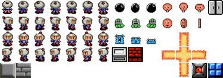

# Projeto Final de Computação Gráfica - BomberMan

## Descrição
Este projeto é uma implementação do clássico jogo Bomberman, desenvolvido como parte do trabalho final da disciplina de Computação Gráfica. O jogo apresenta uma interface gráfica 2D usando a biblioteca Kaboom.js e utiliza sprites para animar personagens e elementos do jogo.

  

## Autores
- Guilherme Lucas Pereira Bernardo - [GuilhermeBn198](https://github.com/GuilhermeBn198)
- Kelvin Araújo Ferreira - [DilliKel](https://github.com/DilliKel)

## Professor Orientador
- Luciano Ferreira Silva

## Como Jogar
O jogo BomberMan pode ser jogado em modo solo ou em dupla. Ao iniciar o jogo, você será apresentado a uma tela de introdução onde pode escolher entre os modos de jogo. No modo solo, você controla um único jogador, enquanto no modo dupla, dois jogadores podem participar simultaneamente.

## Instruções de Controle

### Jogador 1 (Modo Solo)
- Setas direcionais para cima, baixo, esquerda e direita para movimentação.
- Barra de espaço para colocar uma bomba.

### Jogador 2 (Modo Dupla)
- Teclas W, A, S e D para movimentação.
- Tecla Enter para colocar uma bomba.

## Acesse e Jogue
Clique [aqui](https://bomberman-dillikel.vercel.app/) para acessar e jogar BomberMan agora mesmo!

Divirta-se e boa sorte!

---
**Nota:** Certifique-se de que seu navegador está compatível com a execução do jogo. Este projeto pode exigir o uso de um navegador moderno que suporte as tecnologias necessárias.
